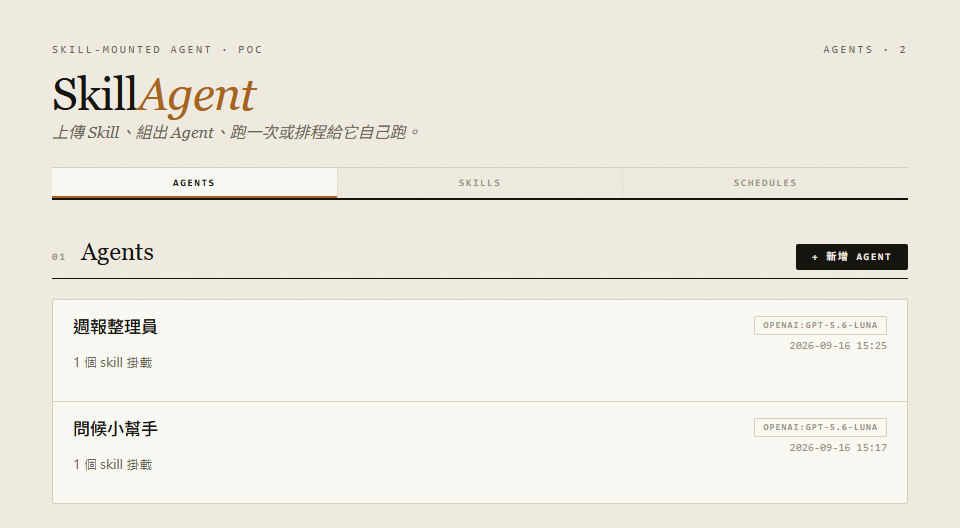
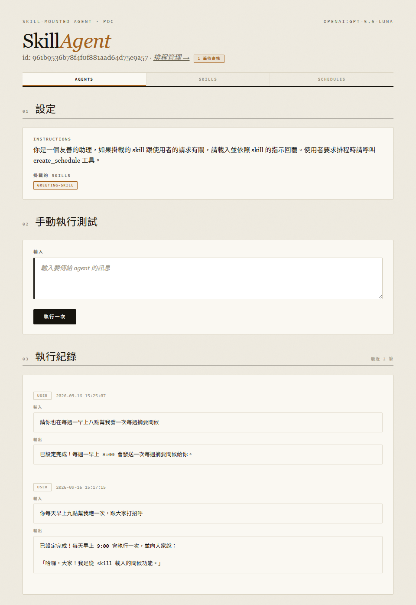
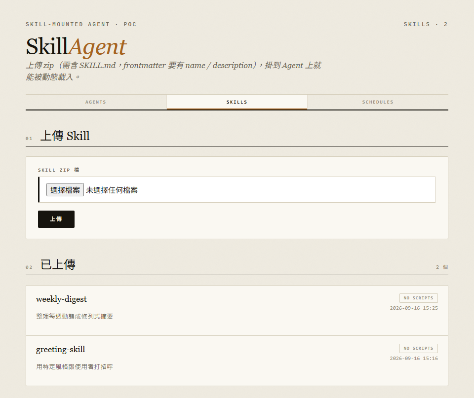

# SkillAgent


<p align="center">
  
</p>

---

**SkillAgent** 讓使用者上傳一個 Agent Skill（`SKILL.md` 加上選配的參考文件與腳本），掛載到一個 Pydantic AI agent 上，手動執行一次，或讓 agent 在對話中直接為自己建立排程、之後定時執行。

掛載 skill 這件事通常需要寫進程式碼或手動配置。SkillAgent 把「上傳哪個 skill」與「哪個 agent 掛哪個 skill」都變成執行期可調整的設定：Agent 執行時才動態組出 `SkillsToolset`，model 依需要漸進式地列出、載入、讀取、執行掛載的 skill。

> [!NOTE]
> 支援 Azure OpenAI（含 v1 GA API）、LiteLLM gateway，或任何 OpenAI 相容端點。排程預設不需要 Redis。

## Features

- **Skill 上傳與驗證** — 解壓 zip、驗證 `SKILL.md` 的 YAML frontmatter 含 `name` 與 `description`、落地存檔。不解析或安裝 skill 附帶的任何依賴。
- **動態掛載** — Agent 執行時組出 `SkillsToolset(directories=[...])`，model 可呼叫 `list_skills` / `load_skill` / `read_skill_resource` / `run_skill_script` 漸進式地發現並使用 skill 內容。
- **Agent 自建排程，人工核准後才會執行** — Agent 在對話中呼叫內建的 `create_schedule` 工具即可為自己安排定時任務，但排程一律從待審核狀態開始，直到人工在排程頁核准為止。詳見〈排程與審核〉。
- **兩種排程執行後端** — 預設用 FastAPI process 內建的 asyncio 迴圈輪詢資料庫執行到期排程，不需要額外服務；正式環境可切換為 Celery beat + worker，兩者共用同一套「輪詢 DB → 執行 agent → 更新 `last_run_at` / `next_run_at`」邏輯。
- **Provider 無關的 model 設定** — Model 以 `provider:model` 字串設定，內建 Azure OpenAI 解析，其餘前綴交由 pydantic-ai 自行處理。

## 排程與審核

Agent 除了掛載的 skill 工具外，永遠掛著一個系統內建工具 `create_schedule`（`app/schedule_tool.py`）。使用者在對話中提出排程需求時，agent 可直接呼叫它把排程寫進資料庫，不需要另外開排程頁面手動填表單。

Agent 自行建立的排程與使用者在頁面上手動設定的排程分開處理：

- Agent 建立的排程一律以 `enabled=false`、`next_run_at=null` 落地，兩種排程執行後端都不會挑到它，在人工核准前不具備任何執行能力。
- `/ui/schedules` 提供跨所有 agent 的排程總覽，待審核項目列在最前面，附相對時間戳與排程觸發時的輸入內容，並連結到對應 agent 的排程頁進行核准。
- 人工在排程頁按下核准後才會計算 `next_run_at`。核准時間記錄在 `Schedule.reviewed_at`，之後人工自行暫停或恢復都不會使其重新回到待審核清單。
- 使用者自己在頁面上建立的排程視為建立當下即已核准，不需經過這一關。
- `MAX_SCHEDULES_PER_AGENT`（預設 20）另外限制單一 agent 尚未核准的排程數量。

<p align="center">
  
</p>

## Screenshots

Agent 詳細頁：掛載的 skill、手動執行測試，以及執行紀錄——包含 agent 自行建立排程後的回覆：



Skill 清單與上傳表單：



## Architecture

| 檔案 | 職責 |
|---|---|
| `app/main.py` | FastAPI 進入點，掛路由、啟動 in-process scheduler |
| `app/config.py` | 環境變數設定（Pydantic Settings） |
| `app/models.py` | `Skill` / `Agent` / `Schedule` / `RunLog` table models |
| `app/skills_service.py` | Skill zip 上傳、frontmatter 驗證、落地存檔 |
| `app/agent_service.py` | 組出 `Agent(model=..., toolsets=[SkillsToolset(...), schedule_toolset])` 並執行一次 |
| `app/schedule_tool.py` | `create_schedule`：agent 自建排程用的內建工具 |
| `app/schedule_service.py` | 排程建立、cron → `next_run_at` 計算（croniter）、查詢到期排程、審核狀態判斷 |
| `app/inprocess_scheduler.py` | 不需要 Redis 的排程執行迴圈 |
| `app/routers/{skills,agents,schedules}.py` | JSON API |
| `app/routers/ui.py` + `app/templates/` | Jinja2 server-rendered 頁面 |
| `worker/celery_app.py` + `worker/tasks.py` | 正式環境用的 Celery beat + worker 排程執行路徑 |

## Setup

需要 Python 3.11+ 與 [uv](https://docs.astral.sh/uv/)。

```bash
git clone https://github.com/breezy89757/SkillWorks.git
cd SkillWorks
uv sync
cp .env.example .env
```

`.env` 至少需要設定 model 端點：

```bash
# Azure OpenAI（優先），或改填 OPENAI_BASE_URL 接 LiteLLM gateway / 其他 OpenAI 相容端點
AZURE_OPENAI_ENDPOINT=https://<your-resource>.openai.azure.com/openai/v1
AZURE_OPENAI_API_KEY=<azure-resource-key>
DEFAULT_MODEL=openai:<deployment-name>
```

```bash
uv run uvicorn app.main:app --reload
```

開啟 <http://localhost:8000>，導向 `/ui/agents`。排程預設使用 in-process backend，不需要另外啟動任何服務。

### 正式環境：改用 Celery + Redis

```bash
# .env 設定 SCHEDULER_BACKEND=celery，然後：
uv run uvicorn app.main:app
uv run celery -A worker.celery_app worker --loglevel=info
uv run celery -A worker.celery_app beat --loglevel=info
```

### 使用流程

1. `/ui/skills` 上傳一個 zip（需含 `SKILL.md`，YAML frontmatter 含 `name` / `description`）
2. `/ui/agents/new` 建立 Agent：填 name、model、勾選要掛載的 skill、填 instructions
3. Agent 詳細頁的「手動執行測試」區塊可直接輸入訊息執行一次
4. 排程頁填 cron 運算式新增排程，或在對話中請 agent 為自己排程；agent 建立的排程需在 `/ui/schedules` 核准後才會開始執行

## Environment variables

| 變數 | 說明 | 預設 |
| :--- | :--- | :--- |
| `DATABASE_URL` | SQLModel/SQLAlchemy 連線字串 | `sqlite:///./data/app.db` |
| `SKILLS_STORAGE_DIR` | Skill 檔案落地目錄 | `./skills_storage` |
| `AZURE_OPENAI_ENDPOINT` / `AZURE_OPENAI_API_KEY` | Azure OpenAI，優先於 `OPENAI_BASE_URL` | *(未設定)* |
| `OPENAI_BASE_URL` / `OPENAI_API_KEY` | 未設定 Azure 時的備援，接 LiteLLM gateway 等 | *(未設定)* |
| `DEFAULT_MODEL` | Agent 表單的預設 model 字串 | `openai:gpt-4o-mini` |
| `SCHEDULER_BACKEND` | `inprocess` / `celery` / `off` | `inprocess` |
| `SCHEDULER_POLL_INTERVAL_SECONDS` | 輪詢到期排程的間隔 | `30` |
| `MAX_SCHEDULES_PER_AGENT` | 單一 agent 未核准排程的數量上限 | `20` |
| `REDIS_URL` | `SCHEDULER_BACKEND=celery` 時的 broker/backend | `redis://localhost:6379/0` |

## 已知限制

- 所有 skill 共用一個 venv，不做依賴隔離或安裝
- Script 執行沒有安全沙箱，權限等同 agent 服務本身
- 排程核准後若要修改內容，需刪除重建

## License

MIT，見 [LICENSE](LICENSE)。
